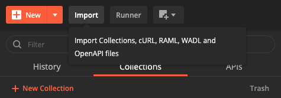

<div class="container-lg clearfix border p-2 bg-blue-light my-">
Per <strong>domande</strong> e/o <strong>suggerimenti</strong> su questa guida, è possibile creare una nuova issue <a href="https://github.com/ondata/guida-api-istat/issues/new">qui</a>
</div>
<br>

> [!IMPORTANT]
> Per evitare il sovraccarico del servizio web SDMX, è stato impostato un limite di **5 query al minuto per ogni IP**. Una volta superato questo limite, viene attivato un blocco di accesso della durata compresa tra **1 e 2 giorni**.
>
> Fonte: <https://www.istat.it/en/classifications-and-tools/sdmx-web-services/>

- [🚀 Quick Start (5 minuti)](#-quick-start-5-minuti)
  - [Esempio 1: Il tuo primo dato ISTAT](#esempio-1-il-tuo-primo-dato-istat)
  - [Esempio 2: Trova tutti i dataset disponibili](#esempio-2-trova-tutti-i-dataset-disponibili)
  - [Esempio 3: Dati specifici (Palermo, feriti, ultimi 10 record)](#esempio-3-dati-specifici-palermo-feriti-ultimi-10-record)
  - [🎯 Prossimi passi](#-prossimi-passi)
- [Perché questa guida](#perché-questa-guida)
- [Specifiche OpenAPI ufficiali](#specifiche-openapi-ufficiali)
- [Come interrogare le API](#come-interrogare-le-api)
  - [SEP (Single Exit Point)](#sep-single-exit-point)
  - [Che strumenti usare](#che-strumenti-usare)
  - [Accedere ai metadati](#accedere-ai-metadati)
  - [Accedere ai dati](#accedere-ai-dati)
  - [Verificare disponibilità dati (availableconstraint)](#verificare-disponibilità-dati-availableconstraint)
- [Qualche esempio](#qualche-esempio)
  - [Scaricare i dati in blocco](#scaricare-i-dati-in-blocco)
  - [Cambiare formato di output](#cambiare-formato-di-output)
  - [Filtrare per periodo temporale](#filtrare-per-periodo-temporale)
  - [Limitare numero osservazioni](#limitare-numero-osservazioni)
  - [Ottenere solo chiavi serie (senza dati)](#ottenere-solo-chiavi-serie-senza-dati)
  - [Applicare dei filtri](#applicare-dei-filtri)
    - [Schema dati](#schema-dati)
    - [Quali codici/valori sono disponibili per filtrare un determinato dataflow per dimensione](#quali-codicivalori-sono-disponibili-per-filtrare-un-determinato-dataflow-per-dimensione)
    - [Costruire l'URL per filtrare un dataflow, fare una query per attributo](#costruire-lurl-per-filtrare-un-dataflow-fare-una-query-per-attributo)
- [Come interrogare le API con Postman](#come-interrogare-le-api-con-postman)
- [Altre banche dati ISTAT accessibili allo stesso modo](#altre-banche-dati-istat-accessibili-allo-stesso-modo)
- [Codici di risposta HTTP](#codici-di-risposta-http)
- [🔧 Troubleshooting](#-troubleshooting)
  - [Errore 413 (Request Entity Too Large)](#errore-413-request-entity-too-large)
  - [Errore 414 (URI Too Long)](#errore-414-uri-too-long)
  - [Errore 400 (Bad Request)](#errore-400-bad-request)
  - [Errore 406 (Not Acceptable)](#errore-406-not-acceptable)
  - [Timeout o lentezza eccessiva](#timeout-o-lentezza-eccessiva)
  - [Dati vuoti o nessun risultato](#dati-vuoti-o-nessun-risultato)
  - [Errore SSL/certificato](#errore-sslcertificato)
  - [Bug endPeriod (+1 anno)](#bug-endperiod-1-anno)
  - [Come ottenere aiuto](#come-ottenere-aiuto)
- [Note](#note)
  - [✅ Validazione e test](#-validazione-e-test)
- [Sostieni le nostre attività](#sostieni-le-nostre-attività)
- [Sitografia](#sitografia)
- [Cheatsheet di riferimento](#cheatsheet-di-riferimento)
- [Webinar dedicato](#webinar-dedicato)


## 🚀 Quick Start (5 minuti)

Vuoi iniziare subito? Ecco 3 esempi che puoi copiare e provare immediatamente.

### Esempio 1: Il tuo primo dato ISTAT

Scarica gli **ultimi 5 record** sugli incidenti stradali in formato **CSV**:

```bash
curl -kL -H "Accept: application/vnd.sdmx.data+csv;version=1.0.0" \
  "https://esploradati.istat.it/SDMXWS/rest/data/41_983?lastNObservations=5"
```

**Output:**

```csv
DATAFLOW,FREQ,REF_AREA,DATA_TYPE,RESULT,TIME_PERIOD,OBS_VALUE,...
IT1:41_983(1.0),A,001001,KILLINJ,F,2024,5,...
IT1:41_983(1.0),A,001001,KILLINJ,F,2023,6,...
IT1:41_983(1.0),A,001001,KILLINJ,F,2022,5,...
```

✅ **Cosa hai fatto:**

- Interrogato dataset `41_983` (Incidenti stradali - comuni)
- Richiesto formato CSV con header `Accept`
- Limitato a 5 osservazioni più recenti con `lastNObservations`

### Esempio 2: Trova tutti i dataset disponibili

Scarica l'elenco di **tutti i dataset** ISTAT interrogabili (circa 450):

```bash
curl -kL "https://esploradati.istat.it/SDMXWS/rest/dataflow
/IT1" > dataflow.xml
```

Apri `dataflow.xml` e cerca dataset di tuo interesse. Ogni `<structure:Dataflow id="...">` è un dataset disponibile.

**Esempio blocco XML:**

```xml
<structure:Dataflow id="41_983" ...>
  <common:Name xml:lang="it">Incidenti, morti e feriti - comuni</common:Name>
  <common:Name xml:lang="en">Road accidents, killed and injured - municipalities</common:Name>
</structure:Dataflow>
```

💡 **Tip:** Puoi consultare [l'elenco CSV già pronto](https://github.com/ondata/guida-api-istat/blob/master/processing/dataflow.csv) invece di processare l'XML.

### Esempio 3: Dati specifici (Palermo, feriti, ultimi 10 record)

Scarica solo i **feriti negli incidenti stradali a Palermo**, ultimi 10 record disponibili:

```bash
curl -kL -H "Accept: application/vnd.sdmx.data+csv;version=1.0.0" \
  "https://esploradati.istat.it/SDMXWS/rest/data/41_983/A.082053.KILLINJ.F?lastNObservations=10"
```

**Output:**

```csv
DATAFLOW,FREQ,REF_AREA,DATA_TYPE,RESULT,TIME_PERIOD,OBS_VALUE,...
IT1:41_983(1.0),A,082053,KILLINJ,F,2024,2576,...
IT1:41_983(1.0),A,082053,KILLINJ,F,2023,2503,...
IT1:41_983(1.0),A,082053,KILLINJ,F,2022,2346,...
```

✅ **Cosa hai fatto:**

- Applicato filtri dimensionali: `A.082053.KILLINJ.F`
  - `A` = frequenza Annuale
  - `082053` = codice comune Palermo
  - `KILLINJ` = tipo dato (killed/injured)
  - `F` = feriti
- Richiesto ultimi 10 record con `lastNObservations=10` (in questo caso 10 anni perché frequenza è annuale)

### 🎯 Prossimi passi

Ora che hai visto le API in azione:

1. **Capire come funziona**: Vai a [Come interrogare le API](#come-interrogare-le-api)
2. **Altri esempi pratici**: Vedi [Qualche esempio](#qualche-esempio)
3. **Filtrare per tue esigenze**: Leggi [Applicare dei filtri](#applicare-dei-filtri)
4. **Reference completa**: Consulta [Cheatsheet di riferimento](#cheatsheet-di-riferimento)

💡 **Consiglio**: Usa **sempre** `firstNObservations` o `lastNObservations` quando esplori un nuovo dataset per evitare download di centinaia di MB!

### 🧪 Testa tutti gli esempi

Tutti gli esempi di questa guida sono stati testati e validati. Puoi eseguire la suite completa di test per verificare che le API siano raggiungibili e funzionanti:

```bash
# Dalla root del repository
./script/test_readme_examples.sh
```

**Cosa testa lo script**:
- ✅ Tutti gli esempi del Quick Start
- ✅ Endpoint metadati (dataflow, datastructure, codelist, availableconstraint)
- ✅ Formati output (CSV, JSON, XML)
- ✅ Filtri temporali e dimensionali
- ✅ Parametri di limitazione (firstN/lastN)

**Output atteso**: `16/16 test superati` in ~2-3 minuti

Questo è utile anche per:
- 🔍 Verificare che le API ISTAT siano online
- 🐛 Diagnosticare problemi di connessione
- 📚 Vedere esempi concreti di chiamate funzionanti

---

## Perché questa guida

L'**Istituto nazionale di statistica** (ISTAT) consente di accedere ai dati del proprio *warehouse* ([http://dati.istat.it/](http://dati.istat.it/)) in molte modalità. L'accesso via ***API REST*** è poco noto, molto comodo, ma **poco documentato**.<br>
Nella [pagina](https://www.istat.it/it/metodi-e-strumenti/web-service-sdmx) ufficiale dei loro *web service* e nelle guide presenti non c'è alcuna documentazione dedicata.<br>
C'è un riferimento alle "*RESTful API*" in questa pagina <http://sdmx.istat.it/SDMXWS/>.

La mancanza di informazioni in merito e le opportunità che vengono offerte, ci hanno spinto a scrivere questa **guida** non esaustiva, che descrive queste modalità di accesso.

Se vuoi proporre una modifica/integrazione/correzione a questa guida, [questo](https://github.com/ondata/guida-api-istat/blob/master/README.md) è il file e [questo](https://github.com/ondata/guida-api-istat) è il repository che ospita il progetto.

## Specifiche OpenAPI ufficiali

A partire dal 2024, il Team per la Trasformazione Digitale ha pubblicato le **specifiche OpenAPI v3** ufficiali delle API ISTAT SDMX (versione **2.0.0**).
Dal **gennaio 2026** ISTAT espone anche una specifica OpenAPI aggiornata su `esploradati.istat.it` (ambiente HVD).

**Risorse ufficiali:**

- **Specifica OpenAPI ISTAT (HVD)**: `https://esploradati.istat.it/HVD/swagger/v2/sdmx-rest.yaml`
- **Specifica OpenAPI completa (mirror Team Digitale)**: [istat-sdmx-rest.yaml](https://raw.githubusercontent.com/teamdigitale/api-openapi-samples/master/external-apis/istat-sdmx-rest.yaml)
- **Endpoint base corrente**: `https://esploradati.istat.it/SDMXWS/rest`
- **Documentazione ISTAT**: [Web Service SDMX](https://www.istat.it/it/metodi-e-strumenti/web-service-sdmx)
- **Documentazione SDMX REST (sdmx-twg)**: https://github.com/sdmx-twg/sdmx-rest/tree/develop/v2_1/ws/rest/docs

### Esempi HVD (SDMX 3.0 / OpenAPI)

La specifica HVD descrive la sintassi SDMX 3.0 con path diversi dal legacy `/rest` (SDMX 2.1). Gli esempi sotto seguono **la specifica HVD** e usano l’endpoint `/rest/v2` (che potrebbe non essere attivo lato server).

```bash
# DATA (SDMX 3.0)
curl -kL -H "Accept: application/vnd.sdmx.data+csv;version=2.0.0" \
  "https://esploradati.istat.it/SDMXWS/rest/v2/data/dataflow/IT1/41_983/1.0/*"

# STRUCTURE (dataflow)
curl -kL -H "Accept: application/vnd.sdmx.structure+json;version=2.0.0" \
  "https://esploradati.istat.it/SDMXWS/rest/v2/structure/dataflow/IT1/41_983/1.0"

# CODELIST (structure)
curl -kL -H "Accept: application/vnd.sdmx.structure+json;version=2.0.0" \
  "https://esploradati.istat.it/SDMXWS/rest/v2/structure/codelist/IT1/CL_FREQ/1.0"

# AVAILABILITY (per componente)
curl -kL \
  "https://esploradati.istat.it/SDMXWS/rest/v2/availability/dataflow/IT1/41_983/1.0/*/REF_AREA"
```

**Nota:** nella OpenAPI HVD non sono previsti `startPeriod`/`endPeriod`; sono invece previsti parametri come `firstNObservations`, `lastNObservations` e `detail`.

Le specifiche OpenAPI documentano in dettaglio:

- Tutti gli endpoint disponibili (data, metadata, availableconstraint)
- Parametri di query con esempi (startPeriod, endPeriod, detail, references)
- Formati di risposta supportati (XML, JSON, CSV, RDF) tramite content negotiation
- Codici di errore HTTP
- Schemi SDMX per periodi temporali

**Nota implementazione**: l'endpoint ISTAT supporta selezione formato solo tramite header `Accept`, non tramite parametro `format` (diversamente da quanto specificato in OpenAPI).

**⚠️ IMPORTANTE - Situazione endpoint (aggiornamento novembre 2025):**

L'endpoint ufficiale `https://esploradati.istat.it/SDMXWS/rest` presenta alcuni problemi confermati da ISTAT Contact Centre e test verificati:

1. **`/rest/v2/data`** documentato ma non ancora implementato
2. **`/rest/data`** funzionante ma con **bug critico filtri temporali `endPeriod`**:
   - ⚠️ **Il parametro `endPeriod` restituisce sempre un anno in più rispetto a quanto richiesto**
   - Esempio: `endPeriod=2020` restituisce dati fino al **2021** incluso
   - Esempio: `endPeriod=2015` restituisce dati fino al **2016** incluso
   - **Workaround**: per ottenere dati fino all'anno N, usare `endPeriod=N-1`
3. **Performance**: più lento (2+ minuti) rispetto endpoint legacy

**Raccomandazione attuale:**

Usare **endpoint ufficiale** `https://esploradati.istat.it/SDMXWS/rest/data` ma **prestare attenzione al bug `endPeriod`**.

**Esempi workaround bug verificato:**

```bash
# ❌ ERRATO: per ottenere dati fino al 2020, NON usare endPeriod=2020
curl -kL -H "Accept: application/vnd.sdmx.data+csv;version=1.0.0" \
  "https://esploradati.istat.it/SDMXWS/rest/data/41_983?endPeriod=2020"
# Restituisce dati fino al 2021! ⚠️

# ✅ CORRETTO: per dati fino al 2020, usare endPeriod=2019
curl -kL -H "Accept: application/vnd.sdmx.data+csv;version=1.0.0" \
  "https://esploradati.istat.it/SDMXWS/rest/data/41_983?endPeriod=2019"

# ✅ CORRETTO: per dati 2020-2021, usare startPeriod=2020&endPeriod=2020
curl -kL -H "Accept: application/vnd.sdmx.data+csv;version=1.0.0" \
  "https://esploradati.istat.it/SDMXWS/rest/data/41_983?startPeriod=2020&endPeriod=2020"
# Restituisce 2020 e 2021
```

📄 **Dettagli completi bug e workaround**: [processing/note-endpoint-esploradati.md](processing/note-endpoint-esploradati.md)

## Come interrogare le API

L'URL base di accesso ufficiale è `https://esploradati.istat.it/SDMXWS/rest`. Da questo si possono interrogare i **metadati** e i **dati**, con una chiamata `HTTP` in `GET`. Quindi pressoché **da qualsiasi client**.

Sono dati esposti secondo lo standard [**SDMX**](https://sdmx.org/).

### SEP (Single Exit Point)

Il **Single Exit Point** (SEP) è l'interfaccia API esposta da ISTAT per l'accesso machine-to-machine ai dati del database [I.Stat](http://dati.istat.it).

Caratteristiche del SEP:

- **Gratuito e liberamente disponibile**: nessuna autenticazione richiesta
- **Formati multipli**: XML, JSON, CSV, RDF
- **Standard SDMX**: conforme ISO 17369
- **Selezione formato**: tramite HTTP content negotiation (header `Accept`)

Esempio selezione formato:

```bash
# Metadati in JSON
curl -H "Accept: application/vnd.sdmx.structure+json;version=1.0" \
  'https://esploradati.istat.it/SDMXWS/rest/dataflow/IT1/115_333/1.0'

# Dati in JSON
curl -H "Accept: application/json" \
  'https://esploradati.istat.it/SDMXWS/rest/data/IT1,115_333?startPeriod=2018&endPeriod=2018'
```

**Importante**: per limitare il volume delle risposte (che possono superare diversi GB), restringere sempre le query con filtri appropriati.

### Che strumenti usare

Vista la modalità di accesso, basta un *browser*, `wget`, `cURL` e/o qualsiasi modulo/funzione che in un linguaggio di scripting consenta l'accesso `HTTP` in `GET`.

In alternativa è possibile usare un software di API development e testing, ad esempio `Postman`. Si rimanda al capitolo dedicato: [Come interrogare le API con Postman](#come-interrogare-le-api-con-postman).

### Accedere ai metadati

Questa è la struttura dell'URL per accedere ai **metadati**:

```
https://esploradati.istat.it/SDMXWS/rest/resource/agencyID/resourceID/version/itemID?queryStringParameters
```

Alcune note:

- `resource` (**obbligatorio**), tipo di risorsa strutturale. Valori principali:
  - `dataflow`, `datastructure`: flussi dati e schemi
  - `codelist`, `conceptscheme`: liste codici e concetti
  - `categoryscheme`, `categorisation`: categorizzazioni
  - `contentconstraint`: vincoli disponibilità dati
- `agencyID`, identificativo agenzia (qui è `IT1`). Multipli con `+` (es. `IT1+ECB`), `all` per tutte
- `resourceID`, ID risorsa. Multipli con `+` (es. `CL_FREQ+CL_CONF_STATUS`), `all` per tutte
- `version`, versione artefatto. Valori: `latest` (ultima produzione), `all` (tutte), o specifica (es. `1.0`)
- `itemID`, ID elemento/gerarchia da restituire
- `queryStringParameters`:
  - `detail`: livello dettaglio metadati (default `full`)
    - `full`: tutte le informazioni disponibili
    - `allstubs`: tutti gli artefatti come stub (solo ID e nome)
    - `referencestubs`: artefatti referenziati come stub
    - `referencepartial`: solo elementi usati (flag isPartial=true)
    - `allcompletestubs`: stub completi con descrizione e annotazioni
    - `referencecompletestubs`: stub completi per artefatti referenziati
  - `references`: artefatti correlati da restituire (default `none`)
    - `none`: nessun riferimento
    - `parents`: artefatti che usano quello richiesto
    - `parentsandsiblings`: parents + artefatti da loro referenziati
    - `children`: artefatti referenziati da quello richiesto
    - `descendants`: riferimenti ricorsivi (tutti i livelli)
    - `all`: combinazione parentsandsiblings + descendants
    - Tipo specifico: es. `codelist`, `datastructure`, `conceptscheme`


Un esempio è quello che restituisce i **`dataflow`**, ovvero l'elenco dei flussi di dati interrogabili.<br>Per averlo restituito l'URL è <https://esploradati.istat.it/SDMXWS/rest/dataflow/IT1>.

Si ottiene in risposta un file XML come [questo](rawdata/dataflow.xml), che all'interno contiene dei blocchi come quello sottostante, in cui ai dati su "Incidenti, morti e feriti - comuni" è associato l'id `41_983`.

```xml
<structure:Dataflow id="41_983" urn="urn:sdmx:org.sdmx.infomodel.datastructure.Dataflow=IT1:41_983(1.0)" agencyID="IT1" version="1.0" isFinal="false">
  <common:Name xml:lang="it">Incidenti, morti e feriti - comuni</common:Name>
  <common:Name xml:lang="en">Road accidents, killed and injured - municipalities</common:Name>
  <structure:Structure>
    <Ref id="DCIS_INCIDMORFER_COM" version="1.0" agencyID="IT1" package="datastructure" class="DataStructure" />
  </structure:Structure>
</structure:Dataflow>
```

L'elenco ad oggi (3 maggio 2020) dei dataset interrogabili è composto da circa 450 elementi, visualizzabili in [questo file CSV](https://github.com/ondata/guida-api-istat/blob/master/processing/dataflow.csv).

### Accedere ai dati

Questa è la struttura dell'URL per accedere ai **dati**:

```
https://esploradati.istat.it/SDMXWS/rest/data/flowRef/key/providerRef?queryStringParameters
```

Alcune note:

- `flowRef` (**obbligatorio**), l'ID del `dataflow` che si vuole interrogare. Formati possibili:
  - Semplice: `115_333` (solo ID)
  - Con agenzia: `IT1,115_333`
  - Con versione: `IT1,115_333,1.2`
- `key`, i parametri dimensionali per filtrare i dati. Sintassi:
  - Chiave completa: `M.DE.000000.ANR` (valori separati da punto)
  - Wildcard: `..000000.ANR` (punto doppio = tutti i valori)
  - OR logico: `A+M.DE.000000.ANR` (simbolo + = valori multipli)
- `providerRef`, l'identificativo dell'agenzia (qui è `IT1`);
- `queryStringParameters`, parametri di query disponibili:

  **Filtri temporali:**
  - `startPeriod`, `endPeriod`: filtro periodo (inclusivo). Formati supportati:
    - ISO 8601: `2020`, `2020-01`, `2020-01-15`
    - SDMX: `2020-Q1` (trimestre), `2020-W01` (settimana), `2020-S1` (semestre), `2020-D001` (giorno)
  - `updatedAfter`: solo dati modificati dopo timestamp (formato ISO 8601 date-time)

  **Limitazione osservazioni:**
  - `firstNObservations`: numero massimo osservazioni dalla più vecchia (es. `firstNObservations=100`)
  - `lastNObservations`: numero massimo osservazioni dalla più recente (es. `lastNObservations=50`)

  **Formato dati:**
  - `dimensionAtObservation`: struttura risposta
    - `TIME_PERIOD` (default): vista time-series
    - ID dimensione: vista cross-sectional
    - `AllDimensions`: vista flat
  - `detail`: quantità informazioni
    - `full` (default): tutti i dati e attributi
    - `dataonly`: solo osservazioni, senza attributi
    - `serieskeysonly`: solo chiavi serie (utile per overview senza scaricare dati)
    - `nodata`: solo metadati e attributi, senza osservazioni

  **Storico:**
  - `includeHistory`: se `true`, include versioni precedenti dei dati

Visto che l'unico parametro obbligatorio è l'ID del *dataflow*, per scaricare quello di sopra sugli incidenti stradali l'URL sarà (**OCCHIO CHE SUL BROWSER pesa**, sono 53 MB di file XML, meglio non fare click e leggerlo soltanto) <https://esploradati.istat.it/SDMXWS/rest/data/41_983>.

### Verificare disponibilità dati (availableconstraint)

Prima di scaricare grandi volumi di dati, è utile verificare quali combinazioni di dimensioni sono effettivamente disponibili.

Endpoint:

```
/availableconstraint/{flow}/{key}/{componentID}?mode={exact|available}
```

Parametri:

- `flow`, `key`: come per endpoint data
- `componentID`: ID dimensione per cui ottenere disponibilità (o `all` per tutte)
- `mode`: tipo di constraint
  - `exact`: valori presenti nei dati che corrispondono alla query
  - `available`: valori validi che possono essere aggiunti alla query corrente

Esempio - verificare disponibilità per tutte le dimensioni:

```bash
curl 'https://esploradati.istat.it/SDMXWS/rest/availableconstraint/115_333/all/all?mode=available'
```

Restituisce ContentConstraint con Cube Region contenente valori disponibili per ogni dimensione.

[`torna su`](#perché-questa-guida)

## Qualche esempio

Per gli esempi sottostanti verrà usata l'*utility* cURL, in quanto disponibile e utilizzabile su qualsiasi sistema operativo.

**NOTA BENE**: scaricando i file in blocco, senza alcun filtro, si ottengono file di **grandi dimensioni**. Pertanto - ove possibile - è consigliato applicare i filtri adeguati ai propri interessi, sia per non avere informazioni ridondanti, che per non stressare il servizio di ISTAT.

### Scaricare i dati in blocco

Il formato di output di default è l'XML.

```bash
curl -kL "https://esploradati.istat.it/SDMXWS/rest/data/41_983" >./41_983.xml
```

### Cambiare formato di output

Basta impostare in modo adeguato l'header `HTTP`.

In CSV:

```bash
curl -kL -H "Accept: application/vnd.sdmx.data+csv;version=1.0.0" "https://esploradati.istat.it/SDMXWS/rest/data/41_983" >./41_983.csv
```

In JSON (dati):

```bash
curl -kL -H "Accept: application/json" "https://esploradati.istat.it/SDMXWS/rest/data/41_983" >./41_983.json
```

In JSON (metadati/strutture):

```bash
# Header specifico per strutture SDMX in JSON
curl -kL -H "Accept: application/vnd.sdmx.structure+json;version=1.0" "https://esploradati.istat.it/SDMXWS/rest/dataflow/IT1/115_333/1.0" >./dataflow.json
```

### Filtrare per periodo temporale

Usare `startPeriod` e `endPeriod` per limitare l'intervallo temporale.

⚠️ **ATTENZIONE BUG `endPeriod`**: Il parametro `endPeriod` restituisce sempre un anno in più. Per ottenere dati fino all'anno N, usare `endPeriod=N-1`. Vedi [sezione bug endpoint](#importante---situazione-endpoint-aggiornamento-novembre-2025) per dettagli completi.

**Formati ISO 8601:**

```bash
# Anno - ATTENZIONE: endPeriod=2021 restituirà dati fino al 2022!
curl -kL "https://esploradati.istat.it/SDMXWS/rest/data/41_983?startPeriod=2020&endPeriod=2021" >./41_983_2020-2021.xml

# Mese
curl -kL "https://esploradati.istat.it/SDMXWS/rest/data/115_333?startPeriod=2020-01&endPeriod=2020-12" >./115_333_2020.xml

# Giorno
curl -kL "https://esploradati.istat.it/SDMXWS/rest/data/115_333?startPeriod=2020-01-01&endPeriod=2020-01-31" >./115_333_gen2020.xml
```

**Formati SDMX:**

```bash
# Trimestre (Q1-Q4)
curl -kL "https://esploradati.istat.it/SDMXWS/rest/data/115_333?startPeriod=2020-Q1&endPeriod=2020-Q4" >./115_333_2020_trimestri.xml

# Semestre (S1-S2)
curl -kL "https://esploradati.istat.it/SDMXWS/rest/data/115_333?startPeriod=2020-S1&endPeriod=2020-S2" >./115_333_2020_semestri.xml

# Settimana (W01-W53)
curl -kL "https://esploradati.istat.it/SDMXWS/rest/data/115_333?startPeriod=2020-W01&endPeriod=2020-W10" >./115_333_2020_settimane.xml
```

### Limitare numero osservazioni

**🚀 STRUMENTO FONDAMENTALE per esplorazione e sviluppo**

I parametri `firstNObservations` e `lastNObservations` sono essenziali per:

- **Test rapidi** prima di download completi (GB di dati)
- **Verifica struttura** senza attendere tempi lunghi
- **Anteprime** per capire se i filtri funzionano
- **Sviluppo** durante creazione query complesse

```bash
# Prime 10 osservazioni (dalla più vecchia) - perfetto per test
curl -kL -H "Accept: application/vnd.sdmx.data+csv;version=1.0.0" \
  "https://esploradati.istat.it/SDMXWS/rest/data/41_983?firstNObservations=10"

# Ultime 5 osservazioni (dalla più recente) - verifica dati recenti
curl -kL -H "Accept: application/vnd.sdmx.data+csv;version=1.0.0" \
  "https://esploradati.istat.it/SDMXWS/rest/data/41_983?lastNObservations=5"

# Combinato con filtri - test su subset specifici
curl -kL -H "Accept: application/vnd.sdmx.data+csv;version=1.0.0" \
  "https://esploradati.istat.it/SDMXWS/rest/data/41_983/A.082053.KILLINJ.F?firstNObservations=3"
```

**Best practice:**
1. **Sempre testare** con `firstNObservations=5-10` prima di download completi
2. **Verificare filtri** con limiti per evitare download errati
3. **Usare `lastNObservations`** per controllare dati più recenti
4. **Rimuovere limiti** solo quando la query è verificata

⚠️ **Attenzione**: Dataset completi possono essere **centinaia di MB o GB** - usa sempre limiti per test!

### Ottenere solo chiavi serie (senza dati)

Parametro `detail=serieskeysonly` restituisce solo elenco serie senza osservazioni (utile per esplorare dataset grandi):

```bash
curl -kL "https://esploradati.istat.it/SDMXWS/rest/data/41_983?detail=serieskeysonly" >./41_983_keys.xml
```

### Applicare dei filtri

Per applicare dei filtri è **necessario** **conoscere** quale sia lo **schema dati** del *dataflow* che si vuole interrogare. Questo è descritto nella risorsa di metadati denominata `datastructure`, che si può interrogare per ID. Ma qual è ad esempio l'ID del *dataset* sugli incidenti stradali, presente in `datastructure`?<br>
È scritto nel *dataflow*. Si riporta nuovamente quello di sopra e si legge che l'ID di riferimento presente in *datastructure* è  `DCIS_INCIDMORFER_COM`.

```xml
<structure:Dataflow id="41_983" urn="urn:sdmx:org.sdmx.infomodel.datastructure.Dataflow=IT1:41_983(1.0)" agencyID="IT1" version="1.0" isFinal="false">
  <common:Name xml:lang="it">Incidenti, morti e feriti - comuni</common:Name>
  <common:Name xml:lang="en">Road accidents, killed and injured - municipalities</common:Name>
  <structure:Structure>
    <Ref id="DCIS_INCIDMORFER_COM" version="1.0" agencyID="IT1" package="datastructure" class="DataStructure" />
  </structure:Structure>
</structure:Dataflow>
```

[`torna su`](#perché-questa-guida)

#### Schema dati

Per leggere lo schema dati di `DCIS_INCIDMORFER_COM`, si potrà lanciare questa chiamata:

```bash
curl -kL "https://esploradati.istat.it/SDMXWS/rest/datastructure/IT1/DCIS_INCIDMORFER_COM/" >./DCIS_INCIDMORFER_COM.xml
```

Nel file [XML di output](esempi/DCIS_INCIDMORFER_COM.xml) c'è il tag `structure:DimensionList` (vedi sotto), che contiene la lista delle dimensioni, ovvero lo schema dati del dataset.<br>
In questo elenco le dimensioni con id `FREQ`, `ESITO`, `ITTER107`,`TIPO_DATO` e `SELECT_TIME`.

```xml
<structure:DimensionList id="DimensionDescriptor" urn="urn:sdmx:org.sdmx.infomodel.datastructure.DimensionDescriptor=IT1:DCIS_INCIDMORFER_COM(1.0).DimensionDescriptor">
  <structure:Dimension id="FREQ" urn="urn:sdmx:org.sdmx.infomodel.datastructure.Dimension=IT1:DCIS_INCIDMORFER_COM(1.0).FREQ" position="1">
    <structure:ConceptIdentity>
      <Ref id="FREQ" maintainableParentID="CROSS_DOMAIN" maintainableParentVersion="4.2" agencyID="IT1" package="conceptscheme" class="Concept" />
    </structure:ConceptIdentity>
    <structure:LocalRepresentation>
      <structure:Enumeration>
        <Ref id="CL_FREQ" version="1.0" agencyID="IT1" package="codelist" class="Codelist" />
      </structure:Enumeration>
    </structure:LocalRepresentation>
  </structure:Dimension>
  <structure:Dimension id="ESITO" urn="urn:sdmx:org.sdmx.infomodel.datastructure.Dimension=IT1:DCIS_INCIDMORFER_COM(1.0).ESITO" position="2">
    <structure:ConceptIdentity>
      <Ref id="ESITO" maintainableParentID="VARIAB_ALL" maintainableParentVersion="18.3" agencyID="IT1" package="conceptscheme" class="Concept" />
    </structure:ConceptIdentity>
    <structure:LocalRepresentation>
      <structure:Enumeration>
        <Ref id="CL_ESITO" version="1.0" agencyID="IT1" package="codelist" class="Codelist" />
      </structure:Enumeration>
    </structure:LocalRepresentation>
  </structure:Dimension>
  <structure:Dimension id="ITTER107" urn="urn:sdmx:org.sdmx.infomodel.datastructure.Dimension=IT1:DCIS_INCIDMORFER_COM(1.0).ITTER107" position="3">
    <structure:ConceptIdentity>
      <Ref id="ITTER107" maintainableParentID="VARIAB_ALL" maintainableParentVersion="18.3" agencyID="IT1" package="conceptscheme" class="Concept" />
    </structure:ConceptIdentity>
    <structure:LocalRepresentation>
      <structure:Enumeration>
        <Ref id="CL_ITTER107" version="4.6" agencyID="IT1" package="codelist" class="Codelist" />
      </structure:Enumeration>
    </structure:LocalRepresentation>
  </structure:Dimension>
  <structure:Dimension id="TIPO_DATO" urn="urn:sdmx:org.sdmx.infomodel.datastructure.Dimension=IT1:DCIS_INCIDMORFER_COM(1.0).TIPO_DATO" position="4">
    <structure:ConceptIdentity>
      <Ref id="TIPO_DATO" maintainableParentID="CROSS_DOMAIN" maintainableParentVersion="4.2" agencyID="IT1" package="conceptscheme" class="Concept" />
    </structure:ConceptIdentity>
    <structure:LocalRepresentation>
      <structure:Enumeration>
        <Ref id="CL_TIPO_DATO22" version="1.0" agencyID="IT1" package="codelist" class="Codelist" />
      </structure:Enumeration>
    </structure:LocalRepresentation>
  </structure:Dimension>
  <structure:TimeDimension id="TIME_PERIOD" urn="urn:sdmx:org.sdmx.infomodel.datastructure.TimeDimension=IT1:DCIS_INCIDMORFER_COM(1.0).TIME_PERIOD" position="5">
    <structure:ConceptIdentity>
      <Ref id="SELECT_TIME" maintainableParentID="CROSS_DOMAIN" maintainableParentVersion="4.2" agencyID="IT1" package="conceptscheme" class="Concept" />
    </structure:ConceptIdentity>
    <structure:LocalRepresentation>
      <structure:TextFormat textType="ObservationalTimePeriod" />
    </structure:LocalRepresentation>
  </structure:TimeDimension>
</structure:DimensionList>
```

Ma qual è il **significato** di `FREQ`, `ESITO`, `ITTER107`,`TIPO_DATO` e `SELECT_TIME`?

La risposta a questa domanda ce la dà la risorsa di metadati - il *package* - denominata `codelist`. Si può interrogare sempre per ID, ma bisogna conoscere l'ID dei vari campi, che è scritto nel file XML di sopra.<br>
Ad esempio in corrispondenza del campo `FREQ` si legge `<Ref id="CL_FREQ" version="1.0" agencyID="IT1" package="codelist" class="Codelist" />`, ovvero che l'ID corrispondente in `codelist` è `CL_FREQ`. L'URL da lanciare per avere le informazioi su questo campo, sarà un altro URL per interrogare metadati e in particolare https://esploradati.istat.it/SDMXWS/rest/codelist/IT1/CL_FREQ.

In output un [file XML](esempi/CL_FREQ.xml), dove si legge che si tratta della "Frequenza". Nell'XML si leggono anche i valori possibili per questa **dimensione**, che per `CL_FREQ` corrispondono alle sottostanti coppie di ID e valore.

| ID  | Descrizione               |
| --- | ------------------------- |
| A   | annuale                   |
| B   | business (non supportato) |
| D   | giornaliero               |
| E   | event (non supportato)    |
| H   | semestrale                |
| M   | mensile                   |
| Q   | trimestrale               |
| W   | settimanale               |

**NOTA BENE**: queste coppie sono quelle genericamente applicabili per la "Frequenza", non è però detto che tutti i valori siano disponibili per un determinato *dataflow* (vedi paragrafo successivo), che potrebbe ad esempio esporre soltanto quella annuale.

[`torna su`](#perché-questa-guida)

#### Quali codici/valori sono disponibili per filtrare un determinato dataflow per dimensione

Per ricavarli è possibile sfruttare la risorsa `availableconstraint`, che in termini SQL è un `SELECT DISTINCT` sulle dimensioni.

Per conoscere ad esempio quelle del dataflow `41_983` l'URL è:

```
https://esploradati.istat.it/SDMXWS/rest/availableconstraint/41_983
```

In output un file XML come [questo](esempi/availableconstraint.xml), in cui ad esempio si legge che per questo specificico *dataflow* il valore disponibile per la dimensione `FREQ` (Frequenza) è `A`, ovvero quella annuale.

```xml
<common:KeyValue id="FREQ">
  <common:Value>A</common:Value>
</common:KeyValue>
```

[`torna su`](#perché-questa-guida)

#### Costruire l'URL per filtrare un dataflow, fare una query per attributo

**Come costruire i filtri passo dopo passo:**

1. **Identifica le dimensioni** dal `datastructure` nell'ordine esatto
2. **Crea la stringa filtro** con valori separati da `.` (punto)
3. **Usa `.`** per dimensioni senza filtro, **valore specifico** per quelle filtrate

**Schema URL:**
```
https://esploradati.istat.it/SDMXWS/rest/data/flowRef/dim1.dim2.dim3.dim4.dim5/
```

**Esempio pratico - incidenti stradali:**

Dal `datastructure` `DCIS_INCIDMORFER_COM` abbiamo 4 dimensioni in questo ordine:
1. `FREQ` (frequenza) - posizione 1
2. `REF_AREA` (territorio/comune) - posizione 2
3. `DATA_TYPE` (tipo dato) - posizione 3
4. `RESULT` (risultato) - posizione 4

**Caso 1 - Tutti i feriti a Palermo:**
- FREQ: `A` (annuale)
- REF_AREA: `082053` (Palermo)
- DATA_TYPE: `KILLINJ` (incidenti)
- RESULT: `F` (feriti)

```bash
curl -kL -H "Accept: application/vnd.sdmx.data+csv;version=1.0.0" "https://esploradati.istat.it/SDMXWS/rest/data/41_983/A.082053.KILLINJ.F" >palermo_feriti.csv
```

**Caso 2 - Tutti i dati di Palermo (senza filtro su RESULT):**
```bash
curl -kL -H "Accept: application/vnd.sdmx.data+csv;version=1.0.0" "https://esploradati.istat.it/SDMXWS/rest/data/41_983/A.082053.KILLINJ." >palermo_tutti.csv
```

**Caso 3 - Più comuni con `+`:**
```bash
curl -kL -H "Accept: application/vnd.sdmx.data+csv;version=1.0.0" "https://esploradati.istat.it/SDMXWS/rest/data/41_983/A.082053+072006.KILLINJ.F" >palermo_bari_feriti.csv
```

**Regole importanti:**
- **Ordine fisso**: Rispetta sempre l'ordine delle dimensioni dal `datastructure`
- **Numero esatto**: Includi tutte le dimensioni con `.` se non filtrate
- **Valori multipli**: Usa `+` per OR logico nella stessa dimensione
- **Nessun filtro**: Usa `../` per dati completi senza filtri

<div id="vis" class="vl-responsive"></div>

<script>
  // carica definizione grafico
  const spec = "./esempi/ISTAT_01.json";
  // renderizza grafico
  vegaEmbed('#vis', spec,{theme: "fivethirtyeight"})

</script>

<br>

**Consigli per esplorazione:**

1. **Prima di filtrare**: Usa `availableconstraint` per vedere quali valori esistono
2. **🔥 SEMPRE testare con limiti**: Aggiungi `?firstNObservations=10` prima di qualsiasi download
3. **Verifica ordine**: Controlla sempre `position` nel `datastructure`
4. **Approccio iterativo**: Test → Verifica → Download completo

Esempio completo con esplorazione:

```bash
# 1. Vedi valori disponibili per territorio
curl -kL "https://esploradati.istat.it/SDMXWS/rest/availableconstraint/41_983/REF_AREA"

# 2. 🔥 Test con pochi record (FONDAMENTALE)
curl -kL -H "Accept: application/vnd.sdmx.data+csv;version=1.0.0" \
  "https://esploradati.istat.it/SDMXWS/rest/data/41_983/A.082053.KILLINJ.F?firstNObservations=5"

# 3. Download completo se il test è corretto
curl -kL -H "Accept: application/vnd.sdmx.data+csv;version=1.0.0" \
  "https://esploradati.istat.it/SDMXWS/rest/data/41_983/A.082053.KILLINJ.F" >palermo_feriti_completo.csv
```

**Filtro temporale aggiuntivo:**

Per limitare il periodo temporale, aggiungi `startPeriod` e/o `endPeriod`:

```bash
# Dati dal 2015 in poi
curl -kL -H "Accept: application/vnd.sdmx.data+csv;version=1.0.0" \
  "https://esploradati.istat.it/SDMXWS/rest/data/41_983/A.082053.KILLINJ.F?startPeriod=2015" >palermo_feriti_2015.csv

# Solo anno 2022-2023
curl -kL -H "Accept: application/vnd.sdmx.data+csv;version=1.0.0" \
  "https://esploradati.istat.it/SDMXWS/rest/data/41_983/A.082053.KILLINJ.F?startPeriod=2022&endPeriod=2023" >palermo_feriti_2022_23.csv
```

## Come interrogare le API con Postman

Un'altra modalità per interrogare le API SDMX di Istat potrebbe essere quella di usare [**Postman**](https://www.postman.com/), un *software* di API *development* e *testing*.

[Vincenzo Sciascia](https://www.linkedin.com/in/vincenzosciascia/) ha scritto una guida dedicata (grazie!), che trovate [**in una lunga e ricca sezione dedicata**](./postman.md).

[](https://ondata.github.io/guida-api-istat/postman.html)

## Altre banche dati ISTAT accessibili allo stesso modo

L'Istat - come è possibile leggere [qui](https://www.istat.it/it/metodi-e-strumenti/web-service-sdmx) - espone nelle stesse modalità anche queste altre 3 banche dati:

- Censimento agricoltura 2010: <http://sdmx.istat.it/WS_CENSAGR/>
- Censimento popolazione e abitazioni 2011: <http://sdmx.istat.it/WS_CENSPOP/>
- Censimento industria e servizi 2011: <http://sdmx.istat.it/WS_CIS/>

A seguire, come esempio, gli *end-point* REST dell'elenco dei *dataflow* (le tabelle esposte) di ciascuna:

- Censimento agricoltura 2010:<http://sdmx.istat.it/WS_CENSAGR/rest/dataflow/IT1/>
- Censimento popolazione e abitazioni 2011: <http://sdmx.istat.it/WS_CENSPOP/rest/dataflow/IT1/>
- Censimento industria e servizi 2011: <http://sdmx.istat.it/WS_CIS/rest/dataflow/IT1/>

## Codici di risposta HTTP

Le API ISTAT SDMX restituiscono i seguenti codici di stato HTTP:

**Successo:**

- `200 OK`: richiesta completata con successo
- `304 Not Modified`: contenuto non modificato (con header `If-Modified-Since`)

**Errori client:**

- `400 Bad Request`: sintassi query non valida
- `406 Not Acceptable`: formato richiesto non supportato
- `413 Request Entity Too Large`: risposta troppo grande (ridurre scope query)
- `414 URI Too Long`: URL troppo lungo (semplificare filtri)

**Errori server:**

- `500 Internal Server Error`: errore generico server
- `503 Service Unavailable`: servizio temporaneamente non disponibile

**Best practice:**

- Usare `If-Modified-Since` header per ridurre traffico (risposta 304 se nessun cambiamento)
- Limitare sempre query con filtri temporali e dimensionali per evitare 413/414
- In caso 503, implementare retry con backoff esponenziale

## 🔧 Troubleshooting

Questa sezione raccoglie i problemi più comuni nell'uso delle API e le relative soluzioni.

### Errore 413 (Request Entity Too Large)

**Sintomo**: La richiesta viene rifiutata perché la risposta sarebbe troppo grande.

```bash
curl: (22) The requested URL returned error: 413
```

**Causa**: Stai richiedendo troppi dati senza filtri adeguati.

**Soluzione**:

1. **Applica filtri temporali** per limitare il periodo:
   ```bash
   # ❌ EVITA: scarica tutto il dataset
   curl "https://esploradati.istat.it/SDMXWS/rest/data/41_983"
   
   # ✅ USA: limita agli ultimi 3 anni
   curl "https://esploradati.istat.it/SDMXWS/rest/data/41_983?startPeriod=2021"
   ```

2. **Usa parametri di limitazione** per test:
   ```bash
   # Prima testa con pochi record
   curl -H "Accept: application/vnd.sdmx.data+csv;version=1.0.0" \
     "https://esploradati.istat.it/SDMXWS/rest/data/41_983?firstNObservations=100"
   ```

3. **Applica filtri dimensionali** per selezionare solo i dati necessari:
   ```bash
   # Filtra per territorio specifico (es. solo Palermo)
   curl "https://esploradati.istat.it/SDMXWS/rest/data/41_983/A.082053.KILLINJ.F"
   ```

### Errore 414 (URI Too Long)

**Sintomo**: L'URL costruito è troppo lungo.

```bash
curl: (22) The requested URL returned error: 414
```

**Causa**: Troppi filtri nell'URL (es. centinaia di comuni separati da `+`).

**Soluzione**:

1. **Riduci il numero di filtri OR**: invece di `comune1+comune2+comune3+...+comune200`, dividi in più richieste
2. **Usa filtri più ampi**: filtra per provincia/regione invece di singoli comuni
3. **Considera query multiple**: fai più richieste separate e aggrega i risultati

```bash
# ❌ EVITA: troppi comuni in una query
curl "...data/41_983/A.001001+001002+001003+...+008000.KILLINJ.F"

# ✅ USA: dividi in query multiple
curl "...data/41_983/A.001001+001002+001003.KILLINJ.F" > parte1.csv
curl "...data/41_983/A.002001+002002+002003.KILLINJ.F" > parte2.csv
```

### Errore 400 (Bad Request)

**Sintomo**: La sintassi della query non è valida.

```bash
curl: (22) The requested URL returned error: 400
```

**Cause comuni**:

1. **Ordine errato delle dimensioni** nel filtro
2. **Numero sbagliato di dimensioni** (troppo poche o troppe)
3. **Codici non validi** per le dimensioni
4. **Formato periodo errato**

**Soluzione**:

```bash
# 1. Verifica l'ordine corretto delle dimensioni dal datastructure
curl "https://esploradati.istat.it/SDMXWS/rest/datastructure/IT1/DCIS_INCIDMORFER_COM/"

# 2. Verifica i codici disponibili con availableconstraint
curl "https://esploradati.istat.it/SDMXWS/rest/availableconstraint/41_983"

# 3. Usa sempre il formato corretto: FREQ.REF_AREA.DATA_TYPE.RESULT
# ❌ ERRATO: dimensioni nell'ordine sbagliato
curl "...data/41_983/082053.A.F.KILLINJ"

# ✅ CORRETTO: ordine dal datastructure
curl "...data/41_983/A.082053.KILLINJ.F"
```

### Errore 406 (Not Acceptable)

**Sintomo**: Il formato richiesto non è supportato.

```bash
curl: (22) The requested URL returned error: 406
```

**Causa**: Header `Accept` non valido o formato non supportato dall'endpoint.

**Soluzione**:

```bash
# ❌ EVITA: formato non supportato
curl -H "Accept: application/xml+custom" "..."

# ✅ USA: formati supportati
# CSV (dati)
curl -H "Accept: application/vnd.sdmx.data+csv;version=1.0.0" "..."

# JSON semplificato (dati)
curl -H "Accept: application/json" "..."

# JSON strutture (metadati)
curl -H "Accept: application/vnd.sdmx.structure+json;version=1.0" "..."

# XML (default, ometti header Accept)
curl "..."
```

### Timeout o lentezza eccessiva

**Sintomo**: La richiesta impiega troppo tempo o va in timeout.

**Causa**: Dataset troppo grande o server sovraccarico.

**Soluzione**:

1. **Testa sempre prima con limiti**:
   ```bash
   # Prima scopri quanto è grande il dataset
   curl -H "Accept: application/vnd.sdmx.data+csv;version=1.0.0" \
     "https://esploradati.istat.it/SDMXWS/rest/data/41_983?firstNObservations=10"
   ```

2. **Usa `detail=serieskeysonly` per esplorare**:
   ```bash
   # Ottieni solo l'elenco delle serie senza dati (molto più veloce)
   curl "https://esploradati.istat.it/SDMXWS/rest/data/41_983?detail=serieskeysonly"
   ```

3. **Applica filtri prima di scaricare**:
   ```bash
   # Filtra per periodo e territorio prima del download completo
   curl "https://esploradati.istat.it/SDMXWS/rest/data/41_983/A.082053..?startPeriod=2020"
   ```

4. **Aumenta il timeout di curl**:
   ```bash
   # Timeout di 5 minuti invece dei 30 secondi default
   curl --max-time 300 "..."
   ```

### Dati vuoti o nessun risultato

**Sintomo**: La richiesta ha successo ma non restituisce dati.

**Causa**: I filtri applicati non corrispondono a dati esistenti.

**Soluzione**:

1. **Verifica la disponibilità** con `availableconstraint`:
   ```bash
   # Controlla quali valori sono effettivamente disponibili
   curl "https://esploradati.istat.it/SDMXWS/rest/availableconstraint/41_983"
   ```

2. **Testa senza filtri dimensionali**:
   ```bash
   # Prima verifica che il dataset contenga dati
   curl -H "Accept: application/vnd.sdmx.data+csv;version=1.0.0" \
     "https://esploradati.istat.it/SDMXWS/rest/data/41_983?lastNObservations=5"
   ```

3. **Controlla il periodo temporale**:
   ```bash
   # ❌ Periodo troppo vecchio o futuro
   curl "...?startPeriod=1900&endPeriod=1910"
   
   # ✅ Usa lastNObservations per vedere i dati più recenti
   curl "...?lastNObservations=10"
   ```

### Errore SSL/certificato

**Sintomo**: Errore di verifica certificato SSL.

```bash
curl: (60) SSL certificate problem: certificate verify failed
```

**Soluzione**:

```bash
# Opzione -k per ignorare verifica certificato (solo per test)
curl -kL "https://esploradati.istat.it/SDMXWS/rest/data/41_983"

# NOTA: in produzione, meglio configurare certificati corretti
```

### Bug `endPeriod` (+1 anno)

**Sintomo**: Il parametro `endPeriod` restituisce un anno in più rispetto a quanto richiesto.

**Causa**: Bug confermato nell'endpoint ISTAT (vedere [nota bug endpoint](#importante---situazione-endpoint-aggiornamento-novembre-2025)).

**Soluzione - Workaround**:

```bash
# ❌ PROBLEMA: per ottenere dati fino al 2020, NON usare endPeriod=2020
curl "https://esploradati.istat.it/SDMXWS/rest/data/41_983?endPeriod=2020"
# Restituisce dati fino al 2021! ⚠️

# ✅ WORKAROUND: per dati fino al 2020, usa endPeriod=2019
curl "https://esploradati.istat.it/SDMXWS/rest/data/41_983?endPeriod=2019"

# ✅ ALTERNATIVA: usa lastNObservations invece di endPeriod
curl "https://esploradati.istat.it/SDMXWS/rest/data/41_983?lastNObservations=10"
```

### Come ottenere aiuto

Se il problema persiste:

1. **Verifica gli esempi funzionanti** nel [Quick Start](#-quick-start-5-minuti)
2. **Esegui la suite di test** per verificare che le API siano raggiungibili:
   ```bash
   ./script/test_readme_examples.sh
   ```
   Questo script testa automaticamente tutti gli esempi della guida (16 test in ~2-3 minuti) e ti dice esattamente cosa funziona e cosa no.
3. **Crea una issue** su GitHub: <https://github.com/ondata/guida-api-istat/issues>
4. **Consulta la documentazione SDMX** ufficiale: <https://github.com/sdmx-twg/sdmx-rest>

[`torna su`](#perché-questa-guida)

## Note

Questa guida è stata redatta **leggendo** la **documentazione** - non di ISTAT - presente **in altri siti** che documentano l'accesso REST a servizi SDMX. Il primo da cui siamo partiti è la [guida delle API](https://data.oecd.org/api/sdmx-json-documentation/) di accesso ai dati de l'"Organisation for Economic Co-operation and Development" (OECD).<br>
Se userete queste API, l'invito è quello di approfondire tramite una o più delle risorse in [sitografia](#sitografia).

### ✅ Validazione e test

**Tutti gli esempi presenti in questa guida sono stati testati e verificati funzionanti.**

È disponibile uno script automatico che testa tutti gli esempi del README:

```bash
./script/test_readme_examples.sh
```

**Lo script verifica**:
- ✅ Quick Start (3 esempi)
- ✅ Metadati (dataflow, datastructure, codelist, availableconstraint)
- ✅ Formati output (CSV, JSON, XML)
- ✅ Filtri temporali (startPeriod, endPeriod)
- ✅ Parametri limitazione (firstN/lastN, detail=serieskeysonly)
- ✅ Filtri dimensionali (singoli e multipli con OR)

**Risultato atteso**: `16/16 test superati` in ~2-3 minuti

Questo strumento è utile per:
- 🔍 Verificare che le API ISTAT siano online e raggiungibili
- 🐛 Diagnosticare problemi di connessione o configurazione
- 📚 Vedere esempi concreti di chiamate funzionanti
- ✅ Validare modifiche alla guida

In ultimo, la cosa più importante: **chiediamo a ISTAT di documentare l'accesso alle loro API in modalità RESTful**.

## Sostieni le nostre attività

Se vuoi **sostenere** le nostre **attività**, puoi farlo [donando il tuo **5x1000**](https://sostieni.ondata.it/).

## Sitografia

**ISTAT e specifiche ufficiali:**

- Specifiche OpenAPI v3 ISTAT (HVD) <https://esploradati.istat.it/HVD/swagger/v2/sdmx-rest.yaml>
- Specifiche OpenAPI v3 ufficiali ISTAT SDMX REST API v2.0.0 (mirror Team Digitale) <https://raw.githubusercontent.com/teamdigitale/api-openapi-samples/master/external-apis/istat-sdmx-rest.yaml>
- I.Stat data warehouse <http://dati.istat.it/>
- Pagina dei Web Service di ISTAT <https://www.istat.it/it/metodi-e-strumenti/web-service-sdmx>
- Registro delle meta informazione dei dati statistici di diffusione di ISTAT in formato SDMX <http://sdmx.istat.it/sdmxMetaRepository/>

**Standard SDMX e guide:**

- SDMX RESTful web services specification <https://github.com/sdmx-twg/sdmx-rest>
- SDMX Technical Standards Working Group <https://github.com/sdmx-twg>
- sdmx-rest Tips for consumers <https://github.com/sdmx-twg/sdmx-rest/wiki/Tips-for-consumers>
- SDMX 2.1 Web services guidelines 2013 <https://sdmx.org/wp-content/uploads/SDMX_2-1-1-SECTION_07_WebServicesGuidelines_2013-04.pdf>
- How to build a rest query to retrieve eurostat data <https://ec.europa.eu/eurostat/web/sdmx-web-services/a-few-useful-points>

[`torna su`](#perché-questa-guida)

## Cheatsheet di riferimento

Lo **SDMX Technical Standards Working Group** ha creato un [*cheatsheet*](https://github.com/sdmx-twg/sdmx-rest/raw/master/v2_1/ws/rest/docs/rest_cheat_sheet.pdf) molto leggibile e didattico, da cui abbiamo preso fortemente spunto. Lo riportiamo a seguire.<br>
**NOTA BENE**: alcune delle opzioni di sotto potrebbero essere non attive presso l'*endpoint* di ISTAT.

**Structural metadata queries:**<br>`https://esploradati.istat.it/SDMXWS/rest/resource/agencyID/resourceID/version/itemID?queryStringParameters`

| Path parameter | Description | Default |
| --- | --- | --- |
| **resource** (mandatory) | The type of metadata to be returned. Values: datastructure, metadatastructure, categoryscheme, conceptscheme, codelist, hierarchicalcodelist, organisationscheme, agencyscheme, dataproviderscheme, dataconsumerscheme, organisationunitscheme, dataflow, metadataflow, reportingtaxonomy, provisionagreement, structureset, process, categorisation, contentconstraint, attachmentconstraint, actualconstraint, allowedconstraint, structure | |
| **agencyID** | Agency maintaining the artefact (e.g.: SDMX) | all |
| **resourceID** | Artefact ID (e.g.: CL\_FREQ) | all |
| **version** | Arterfact version (e.g.: 1.0) | latest |
| **itemID** | ID of the item (for item schemes) or hierarchy (for hierarchical codelists) to be returned. | all |
| **detail** | Desired amount of information. Values: allstubs, referencestubs, allcompletestubs, referencecompletestubs, referencepartial, full. | full |
| **references** | References to be returned with the artefact. Values: none, parents, parentsandsiblings, children, descendants, all, any type of resource. | none |

**Data queries:**<br>`https://esploradati.istat.it/SDMXWS/rest/data/flowRef/key/providerRef?queryStringParameters`

| Path parameter | Description | Default |
| --- | --- | --- |
| **flowRef** (mandatory) | Dataflow ref (e.g. 41_983, etc.) | |
| **key** | Key of the series to be returned (e.g: D.NOK.EUR.SP00.A). Wildcarding (e.g: D..EUR.SP00.A) and OR (e.g: D.NOK+RUB.EUR.SP00.A) supported. | all |
| providerRef | Data provider (e.g.: IT1) | all |
| **startPeriod** | Start period (inclusive). ISO8601 (e.g. 2014-01) or SDMX reporting period (e.g. 2014-Q3). | |
| **endPeriod** | ⚠️ **BUG**: restituisce sempre anno+1. Per anno N usare N-1. ISO8601 (e.g. 2014-01-01) or SDMX reporting period (e.g. 2014-W53). | |
| **updatedAfter** | Last time the query was performed. Used to retrieve deltas. Must be percent-encoded (e.g.: 2009-05-15T14%3A15%3A00%2B01%3A00) | |
| **firstNObservations** | Maximum number of observations starting from the first observation | |
| **lastNObservations** | Maximum number of observations counting back from the most recent observation | |
| **dimensionAtObservation** | Id of the dimension attached at the observation level | TIME_PERIOD |
| **detail** | Desired amount of information to be returned. Values: full, dataonly, serieskeysonly, nodata | full |
| **includeHistory** | Whether to return vintages | false |


**Useful HTTP headers**

| Headers | Description |
| --- | --- |
| If-Modified-Since | Get the data only if something has changed |
| Accept | Select the desired format |
| Accept-Encoding | Compress the response |

**Supported formats**

**Nota**: ISTAT supporta solo selezione formato tramite header `Accept`, non tramite parametro `format` nell'URL.

| Formats | Syntax | Testato ✅ |
| --- | --- | --- |
| SDMX-ML Generic Data | application/vnd.sdmx.genericdata+xml;version=2.1 | |
| SDMX-ML StructureSpecific Data | application/vnd.sdmx.structurespecificdata+xml;version=2.1 | |
| SDMX-JSON Data (semplificato) | application/json | ✅ |
| SDMX-JSON Data (completo) | application/vnd.sdmx.data+json;version=1.0.0 | |
| SDMX-CSV Data | application/vnd.sdmx.data+csv;version=1.0.0 | ✅ |
| SDMX-ML Structure | application/vnd.sdmx.structure+xml;version=2.1 | |
| SDMX-JSON Structure | application/vnd.sdmx.structure+json;version=1.0.0 | ✅ |
| SDMX-ML Schemas | application/vnd.sdmx.schema+xml;version=2.1 | |
| SDMX-ML Generic Metadata | application/vnd.sdmx.genericmetadata+xml;version=2.1 | |
| SDMX-ML StructureSpecific Meta | application/vnd.sdmx.structurespecificmetadata+xml;version=2.1 | |


**Period formats**

|Period|Format|
|--- |--- |
|Daily/Business|YYYY-MM-DD|
|Weekly|YYYY-W[01-53]|
|Monthly|YYYY-MM|
|Quarterly|YYYY-Q[1-4]|
|Semi-annual|YYYY-S[1-2]|
|Annual|YYYY|

**Useful response codes**

|Code| Description |
|--- |--- |
|200 (OK)|Life is good|
|304 (No change)|No change since the timestamp supplied in the If-Modified-Since header|
|400 (Syntax error)|Your query checking you must|
|401 (Login needed)|Only available on a need to know basis|
|403 (Semantic error)|The syntax of the query is OK but it makes no sense anyway. Tolerated only on April Fools|
|404 (Not found)|No results. Mostly harmless, especially if you used updatedAfter|
|406 (Invalid format)|Not a supported format. No worries, SDMX is all you need|
|413 (Results too large)|You know greed is a sin, right?|
|414 (URI too long)|Write short sentences|
|500 (Server error)|Someone somewhere is having a bad day|
|501 (Not implemented)|Feature coming soon in a web service near you|
|503 (Unavailable)|Try again later.|

---

<a rel="license" href="http://creativecommons.org/licenses/by/4.0/"></a><br />Questa guida è distribuita con Licenza <a rel="license" href="http://creativecommons.org/licenses/by/4.0/">Creative Commons Attribuzione 4.0 Internazionale</a>.

[`torna su`](#perché-questa-guida)

## Webinar dedicato

Il 14 maggio 2020 è stato organizzato un webinar dal titolo [Le API sui dati statistici di Istat e il progetto SDMX](https://www.youtube.com/watch?v=0OfsXybrweI), con Fabio Spagnuolo (Istat), Vincenzo Patruno (Istat e vicepresidente di onData) e Andrea Borruso (presidente di onData).

<iframe width="560" height="315" src="https://www.youtube.com/embed/0OfsXybrweI" frameborder="0" allow="accelerometer; autoplay; encrypted-media; gyroscope; picture-in-picture" allowfullscreen></iframe>

Le slide <https://docs.google.com/presentation/d/1pwGvIpynD6NbPyyodS7a_nUiUoAcwwaLc7H-NlVpnpk/present#slide=id.p1>
