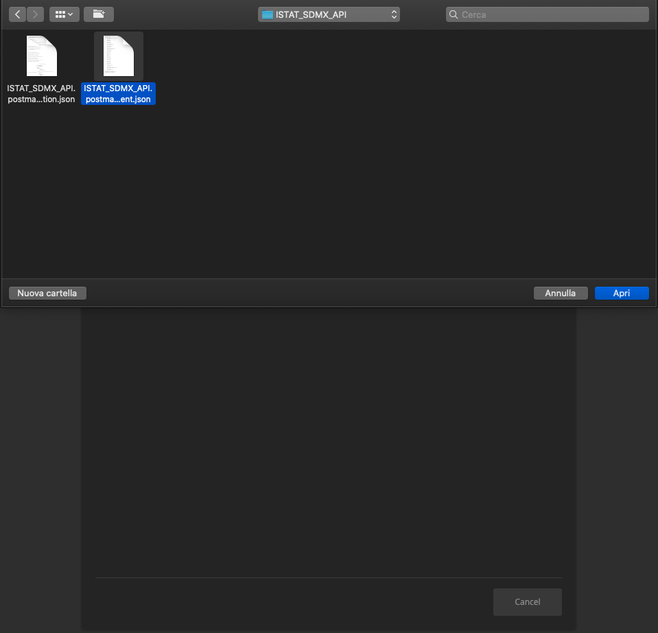

Torna alla <strong><a href="https://github.com/ondata/guida-api-istat/issues/new">pagina principale</a></strong>.

 

- [Come interrogare le API con Postman](#come-interrogare-le-api-con-postman)
  - [Installare Postman](#installare-postman)
  - [Importare la collection ISTAT SDMX API](#importare-la-collection-istat-sdmx-api)
  - [Importare l'environment ISTAT SDMX API](#importare-lenvironment-istat-sdmx-api)
  - [Esplorare la collection ISTAT SDMX API](#esplorare-la-collection-istat-sdmx-api)
  - [Richiedere tutti i dataflow disponibili](#richiedere-tutti-i-dataflow-disponibili)
  - [Ottenere i dati di uno specifico dataflow](#ottenere-i-dati-di-uno-specifico-dataflow)
    - [Richiedere uno specifico dataflow](#richiedere-uno-specifico-dataflow)
    - [Richiedere una datastructure](#richiedere-una-datastructure)
    - [Richiedere una codelist](#richiedere-una-codelist)
    - [Richiedere gli available constraint](#richiedere-gli-available-constraint)
    - [Impostare i filtri](#impostare-i-filtri)
    - [Richiedere i dati](#richiedere-i-dati)

# Come interrogare le API con Postman

Una modalità alternativa per interrogare le API SDMX di ISTAT prevede l'uso del software di API development e testing **Postman**. A supporto di questa modalità sono state preparate:
- una collection che contiene tutte le chiamate alle API disponibili con parametri preconfigurati e dei `test` per automatizzare il workflow di accesso ai dati
- un environment che contiene tutte le variabili d'ambiente

## Installare Postman

- Scaricare **Postman** da [questo link](https://www.postman.com/downloads/)
- Scaricare il file [ISTAT_SDMX_API.postman_collection](https://github.com/vincenzo-scia/guida-api-istat/blob/postman/postman/ISTAT_SDMX_API.postman_collection.json) disponibile su questo repo
- Scaricare il file [ISTAT_SDMX_API.postman_environment](https://github.com/vincenzo-scia/guida-api-istat/blob/postman/postman/ISTAT_SDMX_API.postman_environment.json) disponibile su questo repo
- Lanciare Postman

## Importare la collection ISTAT SDMX API

- Per importare la collection cliccare sul stasto **Import**

- Selezionare il file `ISTAT_SDMX_API.postman_collection.json`

- Confermare l'importazione del file

[`torna su`](#come-interrogare-le-api-con-postman)

## Importare l'environment ISTAT SDMX API

- Per importare l'environment cliccare sul stasto **Manage Environments**

- Cliccare sul tasto **Add** in fondo

- Selezionare il file `ISTAT_SDMX_API.postman_environment.json`

- Attivare l'environment `ISTAT SDMX API` selezionandolo dal menu a tendina

- Visualizzare le variabili d'ambiente contenute nell'enviromnent cliccando sul tasto **Environment quick look** e **Edit**

[`torna su`](#come-interrogare-le-api-con-postman)

## Esplorare la collection ISTAT SDMX API

- La collection contiene tutte le chiamate preconfigurate alle API disponibili

- I dataflow disponibili sono comodamente ordinati in cartelle

## Richiedere tutti i dataflow disponibili

- Selezionare la chiamata `All dataflow JSON` e cliccare sul tasto **Send** per ottenere l'elenco di tutti i dataflow disponibili

[`torna su`](#come-interrogare-le-api-con-postman)

## Ottenere i dati di uno specifico dataflow

Per ottenere i dati di uno specifico dataflow è necessario seguire questi passi

### Richiedere uno specifico dataflow

- Selezionare il dataflow desiderato e cliccare su **Send** per ottenere il risultato

- I parametri associati al dataflow vengono automaticamente salvati dalla collection per essere riutilizzati nelle chiamate successive

### Richiedere una datastructure

- Selezionare la chiamata `Datastructure XML` per ottenere la datastructure dell'ultimo dataflow richiesto e prendere nota delle `codelist` disponibili

### Richiedere una codelist

- Selezionare la chiamata `Codelist XML` per approfondire il significato delle `codelist` dell'ultimo dataflow richiesto

### Richiedere gli available constraint

- Selezionare la chiamata `Available constraint XML` per ottenere l'elenco dei constraint disponibili e prenderne nota perché andranno usati successivamente come filtri per ottenere i dati

### Impostare i filtri

- Cliccare sul tasto **Environment quick look** ed individuare la variabile d'ambiente chiamata `filter_attributes`

- Modificarne il valore inserendo i filtri di cui si è preso nota dopo la chiamata alla `Available constraint XML`

### Richiedere i dati

- Per richiedere i dati selezionare una fra le chiamate `Data JSON output`, `Data CSV output` o `Data XML output`, di seguito un esempio con la chiamata `Data CSV output`

- È possibile esportare l'output usando il tasto **Save Response**

[`torna su`](#come-interrogare-le-api-con-postman)
