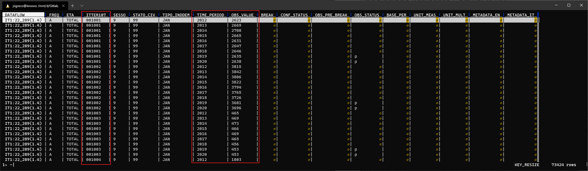
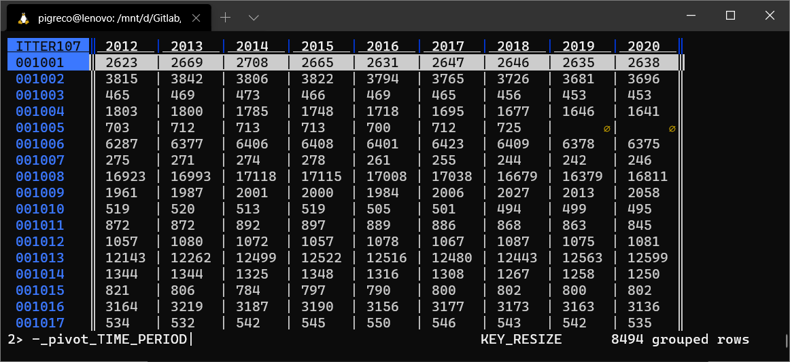
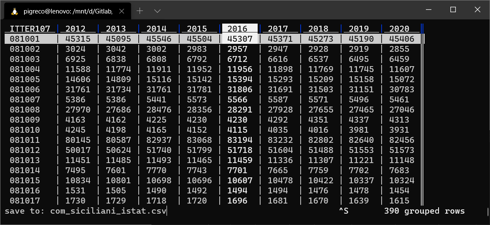

# Popolazione Residente Comuni ISTAT

## Introduzione

Ricetta per scaricare i dati sulla popolazione residente comunali per gli anni da 2012 a 2020 della Regione Sicilia. Utilizzeremo le API ISTAT e ...

## Cosa serve

1. Shell Linux
2. Curl
3. VisiData

## Nota endpoint

Questa ricetta usa l'endpoint ufficiale `https://esploradati.istat.it/SDMXWS/rest` con workaround per bug filtri temporali.

**Bug ISTAT**: per anno N usare `endperiod=N-1`

Dettagli: [../processing/note-endpoint-esploradati.md](../processing/note-endpoint-esploradati.md)

## Comando da lanciare da shell linux

```bash
# Scarica dal 2011 al 2024 (bug: per 2024 usare endperiod=2023)
curl -kL -H "Accept: text/csv" \
  "https://esploradati.istat.it/SDMXWS/rest/data/IT1,22_289/A..JAN.9.TOTAL.99/?startperiod=2011&endperiod=2023" \
  >filtro_tot_comuni.csv
```

**Nota**: il comando richiede diversi minuti per completare (scarica tutti i comuni italiani).

In output si ottiene un file CSV con 18 campi, molti dei quali sono inutili e vanno eliminati; quelli da conservare sono `ITTER107` (che contiene i codici ISTAT dei comuni), `TIME_PERIOD` (gli _anni_) e `OBS_VALUEQ` (valori della _popolazione_):



output visualizzato con [`VisiData`](https://www.visidata.org/)

Ma il **CSV** cosi come scaricato non è molto utile ed è poco leggibile, quindi lo trasformeremo così:



output elaborato e visualizzato con [`VisiData`](https://www.visidata.org/)

Per salvarlo definitivamente nel PC, digitare `Ctrl + s` e poi nome del file.

## Comuni della Sicilia

Per ottenere solo i Comuni siciliani (sono 390) occorre selezionare le righe relative e cancellare le restanti righe. In VisiData:
1. posizionarsi nella prima comonna `ITTER107`;
2. digitare `Shift + |` (pipe) e la regex `^08[1-9]...`
3. invio;
4. digitare `Shift + 2` per creare un nuovo foglio con le righe selezionate;
5. per salvare `Ctrl + s` e scrivere nome file e estensione.



## Regex per le Regioni - in costruzione

Regione | cod_reg | cod_prov | regex
--------|---------|----------|------
Piemonte|1|2,3,1,6,4,5,96,103
Valle d'Aosta|2|7|`^007...`
Lombardia|3|13,14,12,17,18,15,16,19,20,97,98,108
Trentino-Alto Adige|4|21,22|`^02[1-2]...`
Veneto|5|25,26,27,23,24,28,29|`^02[3-9]...`
Friuli Venezia Giulia|6|30,31,32,93
Liguria|7|8,9,10,11
Emilia Romagna|8|36,37,33,34,35,38,39,40,99
Toscana|9|49,50,45,46,47,48,53,51,52,100
Umbria|10|54,55
Marche|11|42,43,44,41,109
Lazio|12|56,57,60,58,59
Abruzzo|13|69,66,67,68
Molise|14|70,94
Campania|15|61,64,65,62,63
Puglia|16|73,74,71,72,110,75
Basilicata|17|76,77
Calabria|18|101,102,78,79,80
Sicilia|19|84,85,86,87,88,81,89,82,83|`^08[1-9]...`
Sardegna|20|111,95,90,91,92

## Riferimenti utili

- [Curl](https://curl.se/)
- [VisiData](https://www.visidata.org/)
- [Guida italiana a VisiData](https://github.com/ondata/guidaVisiData/blob/master/testo/README.md)