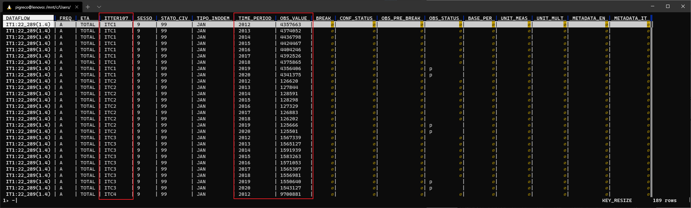
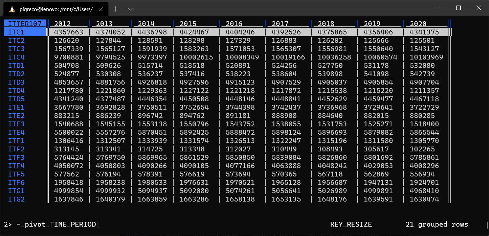

# Popolazione Residente Regioni ISTAT

## Introduzione

Ricetta per scaricare i dati sulla popolazione residente regionale per gli anni da 2012 a 2020. Utilizzeremo le API ISTAT e concateneremo le [NUTS2](https://it.wikipedia.org/wiki/Nomenclatura_delle_unit%C3%A0_territoriali_statistiche) (ITC1+ITC2+ITC3+ITC4+ITD1+ITD2+ITD3+ITD4+ITD5+ITE1+ITE2+ITE3+ITE4+ITF1+ITF2+ITF3+ITF4+ITF5+ITF6+ITG1+ITG2) delle 21 regioni.

## Cosa serve

1. Shell Linux;
2. Installare Curl;
3. Installare VisiData;

## Comando da lanciare da shell linux

```
curl -kL -H "Accept: application/vnd.sdmx.data+csv;version=1.0.0" "http://sdmx.istat.it/SDMXWS/rest/data/22_289/.TOTAL.ITC1+ITC2+ITC3+ITC4+ITD1+ITD2+ITD3+ITD4+ITD5+ITE1+ITE2+ITE3+ITE4+ITF1+ITF2+ITF3+ITF4+ITF5+ITF6+ITG1+ITG2.9.99../?startPeriod=2011" >popResRegioni12-20.csv
```

In output si ottiene un file CSV con 18 campi, molti dei quali sono inutili e vanno eliminati; quelli da conservare sono `ITTER107` (che contiene i _NUTS2_), `TIME_PERIOD` (gli _anni_) e `OBS_VALUEQ` (valori della _popolazione_):



output visualizzato con [`VisiData`](https://www.visidata.org/)

Ma il **CSV** cosi come scaricato non è molto utile ed è poco leggibile, quindi lo trasformeremo così:



output elaborato e visualizzato con [`VisiData`](https://www.visidata.org/)

Per salvarlo definitivamente nel PC, digitare `Ctrl + s` e poi nome del file.

## Riferimenti utili

- [Curl](https://curl.se/)
- [VisiData](https://www.visidata.org/)
- [Guida italiana a VisiData](https://github.com/ondata/guidaVisiData/blob/master/testo/README.md)